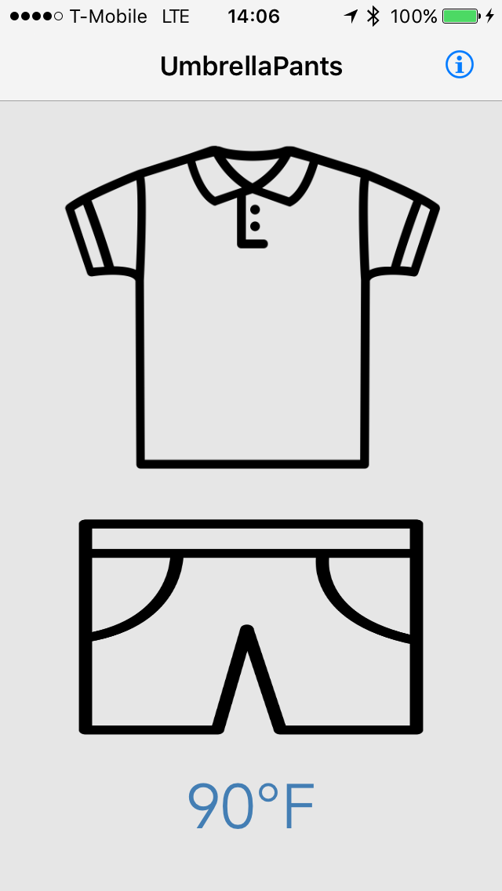

# UmbrellaPants: A Stupidly Simple Weather App

##How does it work?
If you move more than a km or whenever you open the app, UmbrellaPants updates your weather forecast. Here are the cases:

####Raining: 
 - if (temperature<=70°F) {umbrella+pants}
 - if (temperature>70°F) {umbrella+shorts}

####Not Raining:
 - if (temperature<66°F) {jacket+pants}
 - if (temperature>=66°F) {shirt+shorts} 

...and that's all there is to it.
